[](https://github.com/hacs/integration)
[](https://github.com/pre-commit/pre-commit)

:warning: Les n° de contract, et PCE sont désormais des chaine de
caractères afin d'accepter les nombres qui commencent par 0. Si vous avez
une erreur de configuration au redémarrage, vérifiez en mode YAML que vous
avez bien `"21365464"` avec guillemets pour les n° de contrat (Veolia) et
PCE (GRDF).

# Meters To Home Automation (MetersToHA / Meters2HA / M2HA)

Ce script automatise le transfert de l'information de consommation d'eau et
de gaz vers des systèmes domotiques tels que
[Home Assistant](https://www.home-assistant.io/) et
[Domoticz](https://domoticz.com/) et d'autres en MQTT.

C'est un fork de [veolia-idf](https://github.com/s0nik42/veolia-idf) déjà
connu et accélérant le développement.

L'idée est que MetersToHA s'enrichit d'autre collecteurs et systèmes
domotiques afin d'éviter la multiplication de modules à installer - à vous
de jouer.

## Fonctionnalités :

- Récupération des valeurs de consommation au fil du temps;
- Gestion multi-contrat (veolia-idf)
- Vérification de l'intégrité de l'environnement (prérequis / configuration
  sur serveur domotique)
- Mode débogue graphique
- Possible intégration avec d'autre solution domotique (à vous de jouer)

## Table des Matières

<!-- mdformat-toc start --slug=github --no-anchors --maxlevel=4 --minlevel=1 -->

- [Meters To Home Automation (MetersToHA / Meters2HA / M2HA)](#meters-to-home-automation-meterstoha--meters2ha--m2ha)
  - [Fonctionnalités :](#fonctionnalit%C3%A9s-)
  - [Table des Matières](#table-des-mati%C3%A8res)
  - [:warning: Limitations](#warning-limitations)
  - [Informations générales](#informations-g%C3%A9n%C3%A9rales)
  - [Installation](#installation)
    - [Installation sous Linux ou Windows](#installation-sous-linux-ou-windows)
  - [Configuration](#configuration)
    - [Le fichier de configuration (`config.json`)](#le-fichier-de-configuration-configjson)
  - [Les paramètres du script](#les-param%C3%A8tres-du-script)
  - [Installation avec Home Assistant OS](#installation-avec-home-assistant-os)
    - [Add-on MetersToHA (Module complémentaire)](#add-on-meterstoha-module-compl%C3%A9mentaire)
      - [Home Assistant Add-On - méthode manuelle](#home-assistant-add-on---m%C3%A9thode-manuelle)
      - [Home Assistant Add-On - méthode aidé par lien spécial](#home-assistant-add-on---m%C3%A9thode-aid%C3%A9-par-lien-sp%C3%A9cial)
    - [Configuration](#configuration-1)
    - [AppDaemon](#appdaemon)
      - [Installation AppDaemon](#installation-appdaemon)
      - [Ajouter `MetersToHA` à l'AppDaemon avec HACS](#ajouter-meterstoha-%C3%A0-lappdaemon-avec-hacs)
      - [Configuration MetersToHA sous AppDaemon](#configuration-meterstoha-sous-appdaemon)
      - [Débogue avec AppDaemon](#d%C3%A9bogue-avec-appdaemon)
      - [Lancer un appel à Veolia (AppDaemon)](#lancer-un-appel-%C3%A0-veolia-appdaemon)
      - [GRDF (AppDaemon)](#grdf-appdaemon)
      - [Automatisation Home Assistant (AppDaemon)](#automatisation-home-assistant-appdaemon)
    - [Ajout des informations au tableau "Énergie"](#ajout-des-informations-au-tableau-%C3%A9nergie)
  - [Domoticz](#domoticz)
    - [Création du "Virtual Sensor" sur Domoticz :](#cr%C3%A9ation-du-virtual-sensor-sur-domoticz-)
    - [Spécificités de configuration](#sp%C3%A9cificit%C3%A9s-de-configuration)
  - [MQTT](#mqtt)
  - [Fournisseurs](#fournisseurs)
    - [Veolia](#veolia)
    - [GRDF](#grdf)
  - ["Serveurs"](#serveurs)
    - [Docker - "configuration système incluse"](#docker---configuration-syst%C3%A8me-incluse)
    - [Installation "direct"](#installation-direct)
    - [Installation avec le sous-système Windows pour Linux (WSL)](#installation-avec-le-sous-syst%C3%A8me-windows-pour-linux-wsl)
    - [Installation native sous Windows](#installation-native-sous-windows)
      - [Planification de tâche](#planification-de-t%C3%A2che)
    - [Installation de MetersToHA](#installation-de-meterstoha)
      - [Installation avec `git`](#installation-avec-git)
      - [Installation avec une archive](#installation-avec-une-archive)
    - [Automatisation :](#automatisation-)
  - [Dépannage](#d%C3%A9pannage)
    - [Première exécution :](#premi%C3%A8re-ex%C3%A9cution-)
    - [Paramétrer votre système pour le mode débogue (optionnel, mais recommandé)](#param%C3%A9trer-votre-syst%C3%A8me-pour-le-mode-d%C3%A9bogue-optionnel-mais-recommand%C3%A9)
  - [Principe de fonctionnement](#principe-de-fonctionnement)
  - [Environnements testés:](#environnements-test%C3%A9s)
  - [Dépannage:](#d%C3%A9pannage)
  - [Remerciements/Contributeurs](#remerciementscontributeurs)

<!-- mdformat-toc end -->

## :warning: Limitations

- GRDF n'est pas encore compatible avec Domoticz;
- GRDF utilise un captcha. Il peut être validé "tout seul" dans certains
  cas (si peu de requêtes par jour), ou nécessiter une résolution
  interactive, ou un [service de résolution de captcha](#captcha).
- Si vous migrez depuis
  [frtz13/homeassistant_gazpar_cl_sensor](https://github.com/frtz13/homeassistant_gazpar_cl_sensor),
  vous devez désactiver ces automatisations et vos "sensors" de type
  template (dans `configuration.yaml`) - sinon les valeurs écrasent celles
  de MetersToHA.

## Informations générales

MetersToHA fonctionne pour:

- [Veolia IDF - https://www.vedif.eau.veolia.fr](https://www.vedif.eau.veolia.fr/)
  valable pour Veolia en IDF.\
  Vous pouvez trouver votre portail en
  fonction de la ville en visitant
  [https://www.eau.veolia.fr](https://www.eau.veolia.fr/)> CONNECTEZ-VOUS.
- [GRDF - https://monespace.grdf.fr](https://monespace.grdf.fr/client/particulier/accueil).

Il y a différentes options pour mettre en place MetersToHA:

- Installation directe sous Linux ou Windows;
- Avec Home Assistant:
  - Comme 'add-on'/Module Complémentaire - le plus simple;
  - Avec 'AppDaemon', comme 'composant'.

Après l'installation proprement dit, il faudra configurer MetersToHA.\
Cela
implique soit la création d'un fichier de configuration JSON, soit - avec
le add-on MetersToHA sous Home Assistant OS - le remplissage de la
configuration dans l'interface.

Et "enfin", il faudra provoquer l'exécution de MetersToHA.

- Soit en exécution directe du script `meters_to_ha.py` (Linux, Windows);
- Soit en émettant un événement sous Home Assistant (méthode add-on ou
  Appdaemon).

Un peu de débogue peut être nécessaire lors les premières exécutions.

## Installation

### Installation sous Linux ou Windows

Systèmes soutenus:

- Distribution classique: Debian, Ubuntu, Alpine, etc. - physique ou
  Machine Virtuelle (VM);
- Docker - conteneurisation;
- Debian/Ubuntu avec le sous-système Windows pour Linux (WSL);
- Au sein/en parallèle de votre système domotique (AppDaemon pour Home
  Assistant par exemple).
- Utilisation sous Windows (hors Linux/WSL), avec navigation visible.

2. Configuration de MetersToHA - Fichier `config.json` avec les logins,
   etc.

3. Mise au point (essais, correction de configuration).

4. Automatisation (exécution régulière du script).

## Configuration

Le script `meters_to_ha.json` utilise un fichier de configuration au format
json.

Quand MetersToHA est mis en place sous Home Assistant OS (HAOS), vous devez
remplir la configuration dans l'interface du Module Complémentaire
MetersToHA. Le fichier de configuration json sera généré avec cette
configuration.

Pour les autres méthodes, vous créez le fichier `config.json` manuellement.

La documentation du fichier de configuration ci-dessous peut vous aider
également à comprendre les options du module complémentaire MetersToHA sous
HAOS.

### Le fichier de configuration (`config.json`)

Pour Home Assistant, le point de départ peut être
`config.json.exemple.home-assistant` que vous copiez en `config.json` par
exemple.

L'emplacement est libre, mais avec AppDaemon évitez le répertoire
`MetersToHA` qui est supprimé lors de la mise à jour du composant
MetersToHA.

Exemple de configuration:

```json
{
  "veolia_login": "MON_LOGIN_VEOLIA@mon.domaine",
  "veolia_password": "MONPASSEVEOLIA",
  "veolia_contract": "MONCONTRATVEOLIA",
  "grdf_login": "MON_LOGIN_GRDF@mon.domaine",
  "grdf_password": "XXXXXXXXXXXX",
  "grdf_pce": "21546000000000",
  "ha_server": "https://MONINSTANCEHA",
  "ha_token": "MONTOKEN.XXXXXXX.XXXXX-XXXXXXX",
  "2captcha_token": "XXXXXXXXXXX",
  "type": "ha",
  "timeout": "30"
}
```

Les fournisseurs consultables dépendent des paramètres renseignés.\
C.a.d.
qu'il convient de supprimer les clefs inutiles, remplacer "2captcha_token"
par "capmonster_token" ou "captchaai_token" en fonction de votre service,
modifiez la valeur de "type" en fonction de votre plateforme.

Explication des champs:

- `veolia_login`, `veolia_password`: `veolia_contract`:\
  Les informations
  de login sur le site de Veolia IDF, et le numéro de votre
  contrat.\
  Seulement pour Veolia Ile-de-France.

- `grdf_login`, `grdf_password`, `grdf_pce`: Les informations de login sur
  le site de GRDF. L'identification du Point de Comptage et Estimation
  (PCE) est optionnel (actuellement).\
  Seulement pour GRDF.

- `ha_server`: le domaine + le port accessibles depuis là ou le script
  tourne.\
  Cela peut être
  [http://homeassistant.local:8123](http://homeassistant.local:8123) dans
  le cas ou vous n'avez pas touché la configuration réseau.

- `ha_token`: voir ci-dessous, permet d'accéder à Home Assistant depuis le
  script.\
  Seulement pour Home Assistant

- Paramètre pour résolution de captcha.\
  Seulement si vous souhaitez
  résoudre les captchas automatiquement (GRDF, sinon vous devez utiliser
  --debug qui nécessite un serveur X).\
  Un débat assez complet concernant
  ce type de service est dans
  [cet issue d'un autre projet](https://github.com/iv-org/invidious/issues/1256).
  Inutile d'ouvrir un issue de débat ici, sauf pour proposer une
  alternative s'appuyant (moins) sur l'humain.\
  Pour Veolia, vous n'avez
  pas besoin de ce type de service.\
  1,07 capthas/jour ont du être résolus
  en moyenne dans une configuration ou Meters2HA est exécuté jusqu'à deux
  fois par soir (au cas ou le premier appel n'a pas donné de résultat).
  Pour 27% des jours, aucune résolution n'était nécessaire, pour 55% une
  seule résolution, et pour 18%, 2 résolutions.\
  <a id="captcha"></a>Trois
  services sont compatibles, ajouté le paramètre du service choisi, les
  estimations sont sur la base des tarifs et observations en aout 2023:

  - <a id="2captcha"></a>`2captcha_token`: 3€ - ±1000 captchas - environ
    2.5 ans (choisir
    Paypal).\
    [2captcha.com](https://2captcha.com/?from=16639177).\
    2captcha
    indique que les captchas sont résolus par des personnes.
  - <a id="captchamonster"></a>`capmonster_token`: $6 - ±10000 captchas -
    environ 25
    ans.\
    [capmonster.cloud](https://capmonster.cloud/SelectPaymentType).\
    Montant
    minimum $6 pour environ 10000 captchas (paypal), soit 25 ans. Zennolabs
    indique que les captchas sont résolus automatiquement (par machine).
  - <a id="captchaai"></a>`captchaai_token`: Offert (demande mensuelle) ou
    $15/mois soit $180/an.\
    [CaptchaAI](https://captchaai.com/?from=151169)
    vous permet de
    [renouveler sur demande mensuel un token valable un mois après chaque activation](.github/miscdoc/CaptchaAI.md).\
    Cela
    semble contraignant mais vous permet de démarrer.\
    Bien suivre
    <a href=".github/miscdoc/CaptchaAI.md" target="_blank">la procédure</a>
    à chaque fois.

- `type`: "ha" pour Home Assistant, "domoticz" pour Domoticz, "url" pour
  écrire vers un fichier ou "POST"er vers une URL, "mqtt" pour MQTT.

- `url`: Si type est 'url', url de type
  "file://chemin/vers/fichier/local.extension" ou
  "https://domaine.url/pourPOST"

- `timeout`: Le délai en secondes que le script attend pour certaines
  étapes.

- `mqtt_server`, `mqtt_port`, `mqtt_login`, `mqtt_password`: Serveur, port
  et identifiant pour MQTT.

Ne mettez que les valeurs utiles. Si vous consultez seulement Veolia IDF
avec Home Assistant, ceci suffit:

```json
{
  "veolia_login": "MON_LOGIN_VEOLIA@mon.domaine",
  "veolia_password": "MONPASSEVEOLIA",
  "veolia_contract": "MONCONTRATVEOLIA",
  "ha_server": "https://MONINSTANCEHA",
  "ha_token": "MONTOKEN.XXXXXXX.XXXXX-XXXXXXX",
  "type": "ha",
  "timeout": "30"
}
```

## Les paramètres du script

Les paramèters du script sont directement accessible avec l'installation
sous Linux ou Windows, partiellement accessibles avec la configuration
AppDaemon, et modifiables pour la plupart dans la configuration du Module
complémentaire MetersToHA sous HAOS.

| option(s)                                     | Description                                                                                                                                            |
| --------------------------------------------- | ------------------------------------------------------------------------------------------------------------------------------------------------------ |
| -h, --help                                    | Affiche l'aide                                                                                                                                         |
| -r, --run                                     | Exécute le script                                                                                                                                      |
| --version                                     | Affiche la version du programme                                                                                                                        |
| --version-check                               | Vérifie s'il y a une nouvelle version du script (inactif)                                                                                              |
| --veolia                                      | Récupère les données de Veolia IDF                                                                                                                     |
| --grdf                                        | Récupère les données auprès de GRDF                                                                                                                    |
| -d, --debug                                   | Active l'interface graphique interactif (Serveur X nécessaire)                                                                                         |
| --screenshot                                  | Prend une ou plusieurs captures d'écran du navigateur (pour débogue)                                                                                   |
| --local-config                                | Utilise un répertoire local pour la configuration navigateur                                                                                           |
| -l `LOGS_FOLDER`, --logs-folder `LOGS_FOLDER` | Dossier pour les fichiers des traces                                                                                                                   |
| -c `CONFIG`, --config `CONFIG`                | Fichier de configuration                                                                                                                               |
| -k, --keep-output                             | Garde les fichiers récupérés                                                                                                                           |
| --insecure                                    | Ignore les erreurs de certificat du système domotique (utile pour les certificats SSL auto-signés)                                                     |
| --server-type `SERVER_TYPE`                   | Type de destination 'url', 'ha', 'dom', 'mqtt'. Si 'url', le paramètre '--url' est nécessaire                                                          |
| --url URL                                     | Destination du fichier récupéré: Autre fichier (file://...) ou URL web pour une requête POST (http(s)://...)                                           |
| --skip-download                               | Ne télécharge pas le fichier mais utilise le fichier déjà en place, utile pour utiliser un fichier téléchargé interactivement ou bien pour le débogue. |
| --chrome-version CHROME_VERSION               | La version (principale) de chrome lorsque `undetected-chromedriver` est installé.  Un nombre tel que 109, 110, ... .                                   |

Lorsqu'une option est à la fois disponible dans le fichier de configuration
que comme option en ligne de commande, la ligne de commande prend la
priorité.\
Par exemple, l'option `server-type` est la même que `type` dans
le fichier de configuration. Ce qui permet par exemple d'effectuer un
transfert vers un web service en spécifiant
`--server-type url --url https://mon-service.web --skip-download`.

## Installation avec Home Assistant OS

En sus des informations qui suivent,
[Le forum HACF](https://forum.hacf.fr/t/veolia-idf-sedif-consommation-eau-potable-suivi-consommation/11492)
peut également vous aider.

### Add-on MetersToHA (Module complémentaire)

Deux méthodes:

- Ajout de l'Add-on "à la main"
- Ajout aidé par un lien spécial.

Dans les 2 cas, il faudra configurer l'Add-on, le démarrer, et
[définir un automatisme](#automatisation-home-assistant-appdaemon) pour
déclencher l'événement.

Note: Les paramètres `ha_server` et `ha_token` ne sont pas nécessaires
lorsque l'add-on doit alimenter le Home Assistant de la même installation
(donc pas besoin de générer un token soi-même).

#### Home Assistant Add-On - méthode manuelle

Ajouter https://github.com/mdeweerd/MetersToHA comme Dépôt à travers le
menu:

- Aller vers Modules Complémentaires>Boutique des modules complémentaires>⋮
  (en haut à droite)>Dépots ;
- Puis Remplir "Ajouter", puis cliquer "Ajouter";
- Ensuite: attendre un peu, recharger la page de la Boutique des modules;
  complémentaires ou "MetersToHA" devrait apparaître;
- Puis cliquer "MetersToHA";
- Installer, Configurer et Démarrer. (Voir ci-dessous à partir de
  [Installer](#install_addon);
- [définir un automatisme](#automatisation-home-assistant-appdaemon) pour
  le(s) événement(s) choisi(s).

#### Home Assistant Add-On - méthode aidé par lien spécial

Un clic sur le bouton suivant va vous ouvrir une page de redirection de HA.

[](https://my.home-assistant.io/redirect/supervisor_addon/?addon=9120b5c7_meterstoha&repository_url=https%3A%2F%2Fgithub.com%2Fmdeweerd%2FMetersToHA)

Ensuite un click sur le crayon (si c'est la première fois) pour mettre
votre domaine (enregistré en local):

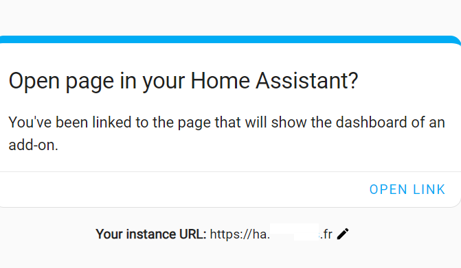

Après cela cliquer sur "Open Link".

Ensuite dans Home Assistant un clic sur "Confirmer" rediriga vers:

<a id="install_addon"></a>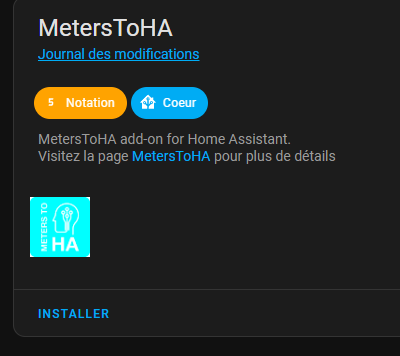

Ensuite, cliquer "Installer":

Après cela, dans "Configuration", définir les champs nécessaires et puis
démarrer le Add-On. Vérifier dans l'onglet Journal de l'Add-on le
démarrage.

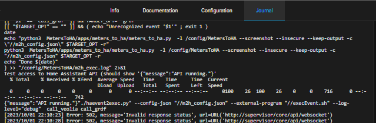

Quand il y a une ligne similaire à la suivante, l'Add-on a bien démarré.
Dans le journal il y a aussi les informations de configuration que vous
pouvez vérifier.

```plaintext
{"message":"API running."}"./haevent2exec.py" --config-json "//m2h_config.json" --external-program "//execEvent.sh" --log-level="debug"  call_veolia call_grdf
```

Pour finir,
[définir un automatisme comme pour la méthode AppDaemon](#automatisation-home-assistant-appdaemon)
pour le(s) événement(s) choisi(s). Et tester.

### Configuration

La valeur pour `ha_token` est seulement nécessaire si on utilise pas la
méthode "Add-on MetersToHA" et peut être obtenu dans
[son profil Home Assistant](https://my.home-assistant.io/redirect/profile/).
Cette fonctionnalité est disponible tout en bas de la page en question ou
il faut cliquer "Créer un jeton":

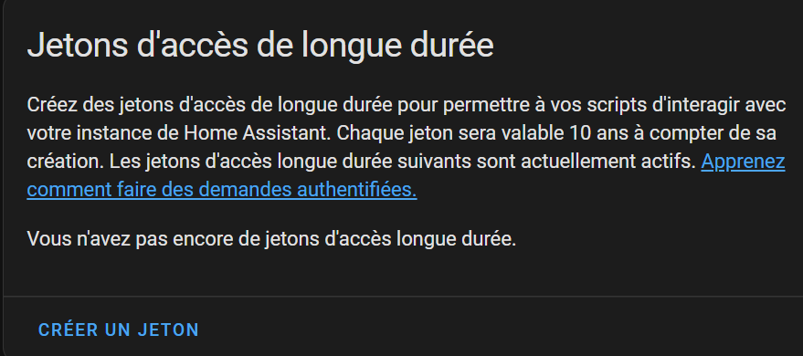

### AppDaemon

L'installation avec
[AppDaemon](https://appdaemon.readthedocs.io/en/latest/INSTALL.html) permet
d'utiliser la même machine que celle de HomeAssistant OS (HAOS) et
nécessite environ 500Mo pour l'installation de AppDaemon et les
paquets.\
C'est un peu plus complexe à mettre en place que la methode
"Module Complémentaire".

Une fois AppDaemon installé, vous pourrez ajouter MetersToHA
[HACS](https://hacs.xyz/) après
[activation des applications AppDaemon dans HACS](https://hacs.xyz/docs/categories/appdaemon_apps/#enable-appdaemon-apps-in-hacs)
comme ceci en suivant "Configuration" pour HACS dans
"Paramètres>Appareils et services":
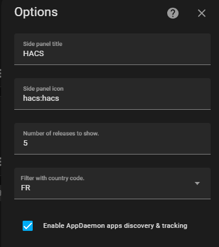.

Les scripts sont placés dans le répertoire
`../config/appdaemon/apps/meters-to-ha`. Le fichier
`meters-to-ha-appdaemon.py` assure l'intégration sous AppDaemon.
`meters_to_ha.py` est le script indépendant et commun à toute installation.

#### Installation AppDaemon

1. [Ajouter le AddON/Module complémentaire « Home Assistant Community Add-on: AppDaemon »](https://appdaemon.readthedocs.io/en/latest/INSTALL.html)
   selon votre système, ou
   [suivez ces instructions pour HAOS](https://github.com/hassio-addons/addon-appdaemon/blob/main/appdaemon/DOCS.md#installation)
   ou aller directement vers le lien (en remplaçant 'VOTREINSTANCE'):
   `VOTREINSTANCE/hassio/addon/a0d7b954_appdaemon/info` , puis « Install »
2. Pour HAOS (et peut-être d’autres), configurer `AppDaemon` au moins avec
   ces paquets (configuration au format `yaml` pour HAOS):

```yaml
init_commands: []
python_packages:
  - selenium
  - PyVirtualDisplay
system_packages:
  - py-urllib3
  - py3-colorama
  - xvfb
  - py3-pip
  - xorg-server-xephyr
  - chromium-chromedriver
  - chromium
  - py3-openssl
  - py3-pysocks
  - py3-wsproto
  - py3-sniffio
  - py3-async_generator
  - py3-sortedcontainers
  - py3-attrs
  - py3-outcome
  - py3-trio
```

- Activer le Watchdog du AddOn, Démarrer le AddOn

#### Ajouter `MetersToHA` à l'AppDaemon avec HACS

Cette procédure suppose que HACS est déjà actif et configuré pour
`AppDaemon`. Ainsi que `AppDaemon` soit activé.

1. Ajouter
   [GitHub - mdeweerd/MetersToHA](https://github.com/mdeweerd/MetersToHA)
   comme source de type AppDaemon:

   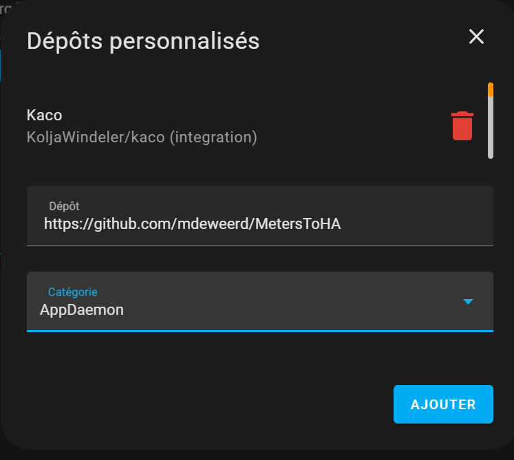

   Note : après l’ajout, le popup reste affiché. Le nouveau module est
   disponible à la fin de la liste:

   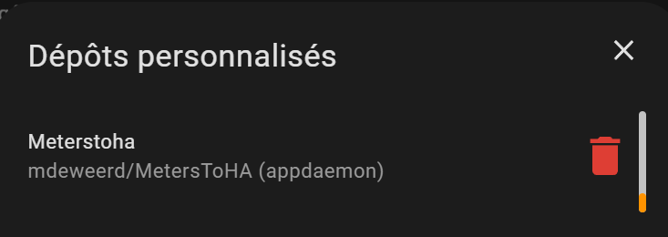

2. Ensuite « télécharger » ce dépôt avec HACS - chercher `meterstoha` parmi
   les « AppDaemons » et cliquez Télécharger ou Download:

   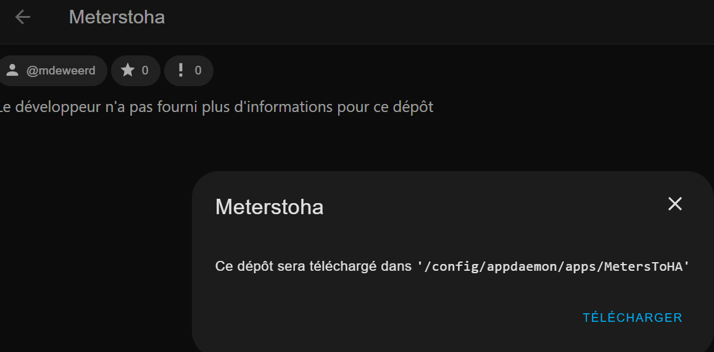

Les scripts sont ainsi disponibles pour AppDaemon.

#### Configuration MetersToHA sous AppDaemon

Reste encore la configuration de `MetersToHA` sous AppDaemon. Plus haut la
création du fichier `config.json` a été expliquée. Vous devez le déposer
sur votre instance Home Assistant, de préférence dans un sous-répertoire de
`.../config`.

Dans l'exemple ci-dessous il est supposé que ce fichier `config.json` est
disponible au chemin `/config/config.json`.

Cette configuration indique aussi que la trace `veolia.log` sera déposé
sous `/config`. Le fichier `/config/veolia.log` pourra aider à identifier
des causes de dysfonctionnement.

Voici un exemple d'une configuration minimale à ajouter à
`/config/appdaemon/apps/apps.yaml` - l'événement déclencheur est par défaut
`call_meters_to_ha`:

```yaml
meters_to_ha:
  module: meters_to_ha_appdaemon
  class: MetersToHA
  config_file: /config/config.json
```

L'exemple suivant montre l'ensemble des arguments disponibles, dont la
précision du chemin vers le script `meters_to_ha.py`, tout en spécialisant
pour un appel à Veolia seulement, et avec le débogue actif qui suppose un
serveur X actif et disponible sur l'IP indiqué.

```yaml
veolia_idf:
  module: meters_to_ha_appdaemon
  class: MetersToHA
  # optionnel - Par défaut "call_meters_to_ha".
  #     Permet de définir plusieurs lancements distincts, par exemple
  #     pour consulter Veolia à une certaine heure, et GRDF à une autre heure.
  event_name: call_veolia
  # optionnel - Par exemple --grdf     pour ne faire que la requête auprès de GRDF
  #                         --veolia   pour ne faire la requête qu'auprès de Veolia
  #                         --insecure pour accepter les certificats SSL non vérifiés
  #                                    (par exemple autosigné).
  extra_opts: [--veolia]
  # optionnel
  log_folder: /config
  # optionnel (Par défaut: "config.json" dans le répertoire de `meters_to_ha.py`)
  config_file: /config/meters_to_ha.json
  # optionnel (Par défaut: "<REALMODULESCRIPTPATH>/meters_to_ha.py")
  # script: /config/meters_to_ha/meters_to_ha.py
  # optionnel (Par défaut: false) - add --keep-output option
  keep_output: true
  # optionnel (Par défaut: false) - add --debug option - nécessite DISPLAY & serveur X!!
  debug: true
  # optionnel (Par défaut: false) - Enable line by line trace output (also add outfile/errfile options to send the output to a file)
  trace: true
  # optionnel (Par défaut: None) - Set DISPLAY for GUI interface (when debug is true)
  DISPLAY: 192.1.0.52:0
  # optionnel (Par défaut: None) - Fichier pour la sortie STDOUT du script
  outfile: /config/appdaemon/apps/meters_to_ha_script.log
  # optionnel (Par défaut: None) - Fichier pour la sortie STDERR du script
  errfile: /config/appdaemon/apps/meters_to_ha_err.log
```

L'option `debug` peut être intéressant lors de la mise en place en cas de
diffucultés mais nécessite un serveur X, la bonne configuration de DISPLAY
et l'autorisation d'accès depuis la machine.\
Par exemple avec

- [Mobaxterm Portable](https://mobaxterm.mobatek.net/download-home-edition.html).\
  Recommandé
  car:
  - "Sans installation";
  - Lance un Serveur X automatiquement;
  - Un popop pour demander l'autorisation lorsque le process tente de se
    connecter;
  - Il suffit alors de définir DISPLAY à `<IP_OU_NOM_RESEAU_PC>:0` après
    avoir lancé ce logiciel et accepté l'accès aux réseaux privés.
- [VcXsvr sous Windows](https://sourceforge.net/projects/vcxsrv/files/vcxsrv/)
  vous devez cocher la case `Disable access control` si l'exécution se fait
  depuis une autre machine (pas si c'est sur la même machine sous Docker).

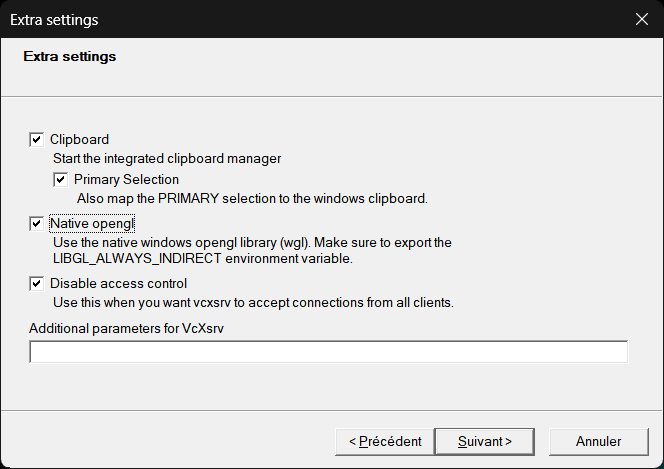

#### Débogue avec AppDaemon

Pour info, il y a une interface web spécifique à AppDaemon (port 5050 par
défaut) : [http://votreinstance:5050](http://votreinstance:5050/) qui donne
entre outre accès à qqs traces et l’historique des appels de scripts.

Sur la page \[http://votreinstance:5050/aui/index.html#/logs\] on peut
trouver par exemple des traces. Exemple avec une erreur:

```plaintext
2022-12-10 13:29:13.182428 ERROR veolia_idf: Done MetersToHA
2022-12-10 13:29:13.157362 ERROR veolia_idf: NameError("name 'sys' is not defined")
2022-12-10 13:29:13.140371 ERROR veolia_idf: Start MetersToHA
2022-12-10 13:29:09.467062 INFO AppDaemon: Initializing app veolia_idf using class MetersToHA from module meters_to_ha
```

#### Lancer un appel à Veolia (AppDaemon)

L’appel est lancé en déclenchant l’événement `call_meters_to_ha` (ou
l'événement défini sous le paramètre `event_name`). Cela peut être fait
dans une automatisation (ce qui permet de le lancer selon un planning par
exemple), ou de façon interactive dans les outils de développement.
L'exemple est avec `call_veolia` (2ième exemple de configuration plus
haut):

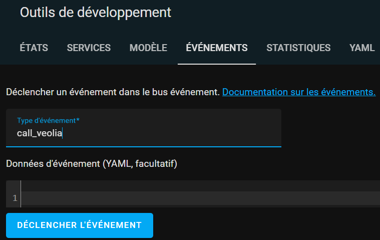

Une trace est systématiquement créé comme `service.log`, soit à
l’emplacement du script, soit dans le répertoire donné par `log_folder:` .
Cela peut déjà aider à identifier les causes, ou tout simplement suivre le
bon déroulement du script.

Extrait de la fin d'une trace:

```plaintext
2022-06-01 18:31:55,541 : -- :  Parsing csv file
2022-06-01 18:31:55,813 : OK : update value for 2022-05-31
2022-06-01 18:31:56,014 : OK : Close Browser
2022-06-01 18:31:56,018 : OK : Close Display
2022-06-01 18:31:56,019 : -- : Remove downloaded file historique_jours_litres.csv Finished on success
```

#### GRDF (AppDaemon)

La configuration c'est presque comme pour Veolia IDF. Comme la consommation
GAZPAR est plutôt disponible en fin de journée, il est intéressant de
consulter GRDF vers 21h par exemple.\
Je recommande donc de personnaliser
l'`event_name`.

Pour GRDF un captcha est présent sur la page et depuis Janvier 2023 les
scripts "simples" ne suffisent plus.

La résolution du captcha se fait soit manuellement (avec débugue actif et
configuration de DISPLAY), soit en s'appuyant sur un
[service de résolution de captchas](#captcha).

```yaml
grdf:
  module: meters_to_ha
  class: MetersToHA
  # optionnel - Par défaut "call_meters_to_ha".
  #     Permet de définir plusieurs lancements distincts, par exemple
  #     pour consulter Veolia à une certaine heure, et GRDF à une autre heure.
  event_name: call_grdf
  # extra_opts - Paramètres complémentaires pour la ligne de commande (optionnel)
  #   --grdf: Consulter GRDF
  #   --veolia: Consulter Veolia IDF
  #   --screenshot: Prendre une capture d'écran avant connexion.
  extra_opts: [--grdf, --screenshot]
  # optionnel - Emplacement des fichiers de trace, screenshot.
  log_folder: /config
  # optionnel (Par défaut: "config.json" dans le répertoire de `meters_to_ha.py`)
  config_file: /config/meters_to_ha.json
  # optionnel (Par défaut: "<REALMODULESCRIPTPATH>/meters_to_ha.py")
  # script: /config/meters_to_ha/meters_to_ha.py
  # optionnel (Par défaut: false) - add --keep-output option
  keep_output: true
  # optionnel (Par défaut: false) - add --debug option - nécessite DISPLAY & serveur X!!
  debug: true
  # optionnel (Par défaut: None) - Set DISPLAY for GUI interface (when debug is true)
  DISPLAY: 192.1.0.52:0
  # optionnel (Par défaut: None) - Fichier pour la sortie STDOUT du script
  outfile: /config/appdaemon/apps/meters_to_ha_script.log
  # optionnel (Par défaut: None) - Fichier pour la sortie STDERR du script
  errfile: /config/appdaemon/apps/meters_to_ha_err.log
```

Configuration typique:

```yaml
grdf:
  module: meters_to_ha
  class: MetersToHA
  event_name: call_grdf
  extra_opts: [--grdf, --screenshot]
  log_folder: /config
  config_file: /config/meters_to_ha.json
  keep_output: true
```

#### Automatisation Home Assistant (AppDaemon)

Pour réaliser la tache de récupération une fois par jour, vous pouvez
ajouter un automatisme à votre configuration Home Assistant comme ceci:

```yaml
alias: Veolia
description: Déclencher l'événement qui démarre l'application MetersToHa sous AppDaemon
trigger:
  - platform: time_pattern
    hours: '1'
    minutes: '7'
    alias: Déclenchement à partir de l'heure choisie
condition: []
action:
  - delay: '{{ range(0, 90*60+1) | random }}'
    alias: Avec un délai variable pour ne pas charger le serveur tous en même temps.
  - event: call_meters_to_ha
    event_data: {}
    alias: Déclenche l'événement définit dans la configuration 'AppDaemon'
mode: single
```

Cela récupère la consommation dans les 90 minutes suivant 1h07 en émettant
l'événement `call_meters_to_ha` ce qui déclenche le script sous AppDaemon.
Il mettre en place une automatisation par fournisseur (avec événements
différents) si vous souhaitez des horaires différents. Prenez en compte un
délai de minimum 5 minutes entre les 2 événements (pour limiter les
ressources utilisées sur votre système).

Exemple pour GRDF ou l'on tente de récupérer les données jusqu'à deux fois,
avec une condition qui vérifie que la dernière mise à jour était il y a
plus de 17h.

```yaml
alias: Appel GRDF
description: ''
trigger:
  - platform: time_pattern
    hours: '21'
    minutes: '1'
    seconds: '0'
  - platform: time_pattern
    hours: '23'
    minutes: '1'
    seconds: '0'
condition:
  - condition: template
    value_template: >-
      {{
      (as_timestamp(now())-as_timestamp(states.sensor.gas_consumption_kwh.last_updated|default('1970-01-01')))
      > 17*3600 }}
action:
  - delay: '{{ range(0, 55*60+1) | random }}'
    alias: Avec un délai variable pour ne pas charger le serveur tous en même temps.
  - event: call_grdf
    event_data: {}
mode: single
```

### Ajout des informations au tableau "Énergie"

Quel que soit la méthode pour lancer le script, il convient de configurer
votre tableau "Énergie" pour le suivre dans Home Assistant.

Pour cela, accédez à la
[page de configuration du tableau "Énergie"](https://my.home-assistant.io/redirect/config_energy/).

Ajouter les nouveaux compteurs (eau, gaz) dans les bonnes classes. Il
convient de choisir les totaux ici (pas les entités `daily`). Les compteurs
permettent d'afficher la consommation journalière facilement sur d'autres
pages que le Tableau Énergie.

La documentation officielle indique qu'il faut attendre deux heures pour
voir apparaître la consommation sous le panneau Énergie. Mais ce sera plus
car la première valeur sert de référence.

## Domoticz

Prérequis :

- "Virtual Sensor" sur Domoticz;
- Une installation de type "serveur" ou Docker.

### Création du "Virtual Sensor" sur Domoticz :

- Créer un Matériel de Type "Dummy": Domoticz> Setup> Hardware> Dummy

- Créer un "Virtual Sensor" de type : "Managed Counter"

- Configurer le sensor: Domoticz> Utility> `Bouton "edit" de votre sensor`

  | >                   | Sensor pour conso eau |
  | ------------------- | --------------------- |
  | __Type Counter__    | water                 |
  | __Counter Divider__ | 1000                  |
  | __Meter Offset__    | 0                     |

### Spécificités de configuration

Outre que la configuration des informations fournisseur et éventuelle clef
pour les captchas, vous devez définir les champs suivants:

| Clef JSON             | Exemple                | Description                                                                                 |
| --------------------- | ---------------------- | ------------------------------------------------------------------------------------------- |
| __"domoticz_server"__ | http://127.0.0.1:8080/ | Url du serveur Domoticz                                                                     |
| __"domoticz_idx"__    | 123                    | Le numero du "virtual sensor" Domoticz crée (se trouve dans : DomoticzDevices (Colonne Idx) |

## MQTT

Non testé.

## Fournisseurs

### Veolia

Il semblerait que les données restituées par Veolia sont des fois un peu
"farfelues". La meilleure méthode connue pour éviter cela est de
contournement c'est de réaliser l'appel entre 1h du matin et minuit.

Le délai variable permet de repartir l'heure d'appel à Veolia entre les
utilisateurs pour ne pas encombre le service. Vous pouvez aussi/en sus
définir une heure différente de 1h07 dans votre configuration Vous pouvez
sûrement accepter de récupérer l'information un peu plus tard que cela vu
qu'elle est de tout façon déjà décalé de qqs jours.

Voici un exemple d'une récupération pour une journée partielle:


Et voici un exemple de données "farfelues" (les 5400L de conso journalière
sont inexactes).

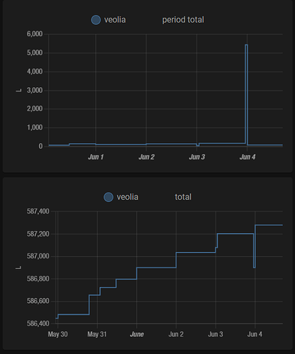

### GRDF

Pour le moment pas compatible avec Domoticz (le "connecteur" nécessite un
développement).

Les données sont souvent à jour après 17h, mais régulièrement plus tard.
Pour éviter des appels API inutiles (sans nouvelles données), il semble
judicieux de les programmer à partir de 21h seulement.

## "Serveurs"

### Docker - "configuration système incluse"

La mise en place le plus rapide est à priori avec Docker. Cela peut vous
aider à mettre au point votre fichier de configuration sans que cela soit
un passage obligé.

Il vous faudra environ 500Mo en sus de l'installation de
[Docker](https://docker.com).

Vous pouvez vous passez de Docker et économiser des ressources en vous
appuyant sur un serveur Linux que vous utilisez par ailleurs, ou encore
votre système Domotique (tel que AppDaemon avec Home Assistant).

En résumé, les fichier suivants donnent la configuration de Docker:

- `docker-compose.yml` : plusieurs configurations de conteneurs
  (environnements d'exécution) fonctionnelles, dont des configurations pour
  le débogue.
- `Dockerfile*`: Fichiers définissant "l'installation" de conteneurs.

A cela vous devez "juste" ajouter votre fichier de configuration
"config.json".

Et puis vous exécutez l'une de ces commandes:

```shell
docker compose run --rm meters-to-ha-veolia
docker compose run --rm meters-to-ha-grdf
```

Ou en mode débogue (nécessite un serveur X local):

```shell
docker compose run --rm meters-to-ha-debug-veolia
docker compose run --rm meters-to-ha-debug-grdf
```

Docker a parfois
[un bogue (?)](https://github.com/docker/for-win/issues/13398) concernant
`host.docker.internal` utilisé comme adresse pour le hôte sur lequel tourne
docker. Dans ce cas, vous pouvez fournir la configuration DISPLAY avec l'IP
de votre PC directement avec `-eDISPLAY=`:

```shell
docker compose run -eDISPLAY=10.33.2.69:0.0 --rm meters-to-ha-debug-grdf
```

L'automatisation de l'exécution avec Docker dépendre de votre système - le
conteneur Docker ne tourne pas en tache de fond - il n'est pas prévu pour
automatiser la tache par lui-même.

Sous Windows vous pourrez utiliser l'outil "Planificateur de tâches".\
Sous
Linux, vous utiliserez cron (crontab).

Pour mettre à jour une image docker, il faut recourir à 'build'. Exemple:

```shell
docker compose build meters-to-ha-veolia
```

### Installation "direct"

De façon générale, le "serveur" nécessite l'installation des logiciels et
bibliothèques prérequis:

- Navigateur web + bibliothèque d'interface de contrôle:
  - `firefox`+`geckodriver`, ou,
  - `chromium`+`chromium-driver`
- xvfb : Framebuffer (virtuel)
- xephyr : Serveur X imbriqué (recommandé)
- python3 : Interpréteur de scripts "Python"
- Modules python3 (à installer) :
  - selenium
  - pyvirtualdisplay
  - colorama
  - urllib3
  - requests
  - paho-mqtt (en cas d'utilisation de MQTT)

Les fichiers Dockerfile (Ubuntu 22.04), DockerfileDebian (Debian bullseye),
et DockerfileAlpine (Alpine 3.17) peuvent vous aider pour trouver les
commandes d'installation.

Les modules python3 sont disponibles pour la plupart comme paquet système,
sinon vous pourrez aussi les installer avec pip (avec le `requirements.txt`
fournit dans ce dépôt):

```shell
python3 -m pip3 install -r requirements.txt
```

### Installation avec le sous-système Windows pour Linux (WSL)

L'installation dans le sous-système Windows pour Linux (WSL) devrait être
également possible. Et à priori on peut même y configurer des tâches avec
cron. Toutefois, l'évolution d'une installation système WSL à une autre
peut nécessiter de tout réinstaller - pensez à gardez une copie de votre
configuration et un script d'installation des outils.

Toutefois cette méthode n'a pas été testée.

### Installation native sous Windows

Pour une solution n'utilisant aucune forme de Linux sous Windows (ni WSL,
ni Docker, ni une VM), vous devez installer Python sous Windows et les
modules nécessaires. La version testée est
[3.10.9 obtenu depuis https://www.python.org/downloads/windows/](https://www.python.org/downloads/windows/).

Vous aurez également besoin de
[ChromeDriver](https://chromedriver.chromium.org/downloads) pour Windows.

Vous pouvez extraire le fichier `ChromeDriver.exe` qui correspond à votre
version Chrome directement dans le dépôt que vous avez récupéré.

Une autre méthode qui semble fonctionne c'est de laiser faire
`undetected-chromedriver` à installer avec

```shell
pip install undetected-chromedriver
```

`undetected-chromedriver` est un module qui se charge de récuperer le
binaire et de le patcher pour que la navigation soit moins détectable comme
une navigation géré par un automatisme. Cela semble avoir une certaine
efficacité pour la validation simple d'un captcha. Il faudra probablement
ajouter l'option `--chrome-version` au lancement de `meterstoha.py` (voir
[METERSTOHA.BAT](METERSTOHA.BAT) pour un exemple d'automatisation).

Ensuite vous devez [installer MetersToHA](#installation-de-meterstoha).

Pour le lancement sous Windows, vous devez renseigner les chemins de
`chrome` et `chromedriver` (absolu ou relatifs depuis là ou vous lancez le
script).\
Vous pouvez omettre `chromedriver` si vous avez installé le
module `undetected-chromedriver`.

Un exemple d'un fichier de configuration est:

```json
{
  "veolia_login": "monm\u00e9l@mon.domaine",
  "veolia_password": "mot de passe",
  "veolia_contract": "5453325",
  "grdf_login": "monm\u00e9l@mon.domaine",
  "grdf_password": "mot de passe",
  "grdf_pce": "21546000000000",
  "ha_server": "http://homeassistant.local:8123",
  "ha_token": "XXXXXXXXXXXXXXXXXXXXXX",
  "chromium": "c:\\Program Files (x86)\\Google\\Chrome\\Application\\chrome.exe",
  "chromedriver": ".\\chromedriver.exe",
  "type": "ha",
  "timeout": "30"
}
```

Sans l'option `--debug` le déroulement sera visible. Dans ce cas s'il y a
un captcha à résoudre, le login ne sera pas réussi. L'option `--screenshot`
permet d'enregister le ontenu du navigateur (caché) dans
`screen_before_connection.png` ou vous pouvez vérifier s'il y avait un
captcha ou pas.

Sinon, pour la résolution du captcha sous Windows en mode interactif,
l'option `--debug` est nécessaire. Lorsque le popup apparaiti, vous\
devez
le captcha et le valider. Cliquez le bouton "Connexion" également. Si le
captcha est validé automatiquement, le script avance automatiquement comme
en mode caché et vous n'aurez pas à résoudre de captcha.

Exemple de lancement, avec un fichier de configuration appelée
`winconfig.json`, avec une capture d'écran avant connexion.

```shell
python apps/meters_to_ha/meters_to_ha.py -c winconfig.json --grdf -r --debug --screenshot
```

Le fichier [METERSTOHA.BAT](METERSTOHA.BAT) montre plus de variantes sur le
lancement (interactif ou pas, avec trace ou pas).

Pour plus d'information concernant le contenu du fichier de configuration,
vérifiez
[le paragraphe correspondant](#le-fichier-de-configuration-configjson) dans
le présent document.

#### Planification de tâche

Vous pouvez planifier l'exécution de la tâche sous Windows.

Pour y parvenir, cherchez `Planificateur de tâches` dans la zone de
recherche windows.\
Choissez "Créer une tâche de base" et suivre le
processus. Choississez "Tous les jours" et "Démarrez le" à une heure qui
sera celle de tous les jours. Puis "Démarrer un programme".\
Il est ensuite
important de choisir votre `pythonw.exe` comme programme, les paramètres et
"Commencez dans" qui doit correspondre au chemin de MetersToHA (contenant
le sous-répertoire apps).

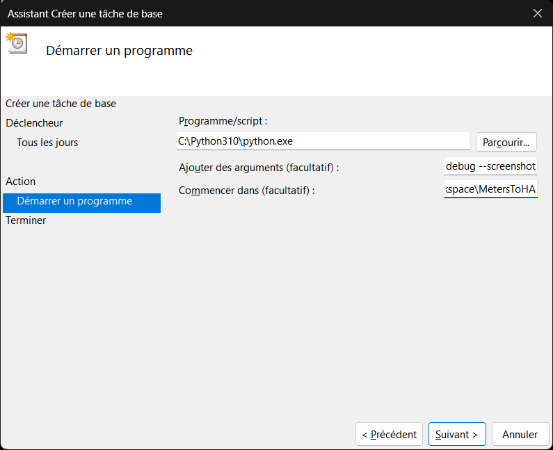

Avant de "Terminer", choisissez d'ouvrir les propriétés de la tâche afin de
pouvoir activer l'exécution même si l'utilisateur n'est pas connecté. Vous
pourrez y ajuster également d'autres paramètres (voir les onglets).

Trouvez la tache dans "Bibliothèque du Planificateur de tâches" et faites
"Exécuter" (dans le menu accessible par clique droit de la tâche) afin de
vérifier que cela fonctionne (vérifiez les fichiers de sortie).\
Quand cela
ne fonctionne pas, assurez-vous que tous les chemins sont corrects.

### Installation de MetersToHA

Vous pouvez extraire les fichiers de ce dépôt ou vous voulez.

Le script `apps/meters_to_ha/meters_to_ha.py` et son fichier de
configuration `config.json` suffisent (en sus des prérequis).\
Le fichier
`config.json.exemple` peut servir comme base pour réaliser votre fichier de
configuration.

En utilisant git, vous facilitez la mise à jour, sinon téléchargez
l'archive.

#### Installation avec `git`

Récupération initiale:

```shell
cd REPERTOIRE_DE_DESTIONATION
git clone https://github.com/mdeweerd/MetersToHA
cd MetersToHA

pip3 install -r requirements.txt
# ou
python -m pip install -r requirements.txt
```

Mise à jour:

```shell
git pull
```

#### Installation avec une archive

Extraire l'archive, puis s'assurer que le script est exécutable (\*nix):

```shell
chmod ugo+x apps/meters_to_ha/meters_to_ha.py
```

### Automatisation :

Une automatisation permettra de lancer la récupération une fois par jour.
Il est bien sûr préférable de d'abord valider le fonctionnement sans
automatisation.

Vous pouvez faire cela avec `cron` et un de ses fichiers de configuration
`crontab`. Pour cela, ajoutez la ligne suivante à votre planificateur de
tâches :

```shell
./apps/meters_to_ha/meters_to_ha.py --run
```

Exemple ici avec `crontab` que l'on peut éditer avec :

```shell
crontab -e
```

Pour y ajouter le contenu qui suivent tout en:

- Modifiant les chemins selon votre installation;
- Garder que les lignes utiles (Veolia et/ou GRDF)

```crontab
SHELL=/bin/bash
M2HA_PATH=/opt/MetersToHA/apps/meters_to_ha/
M2HA_SCRIPT=${M2HA_PATH}apps/meters_to_ha/meters_to_ha.py
M2HA_CONFIG=${M2HA_PATH}config.json
M2HA_LOG=${M2HA_PATH}meters_to_ha.log
# Veolia
0  1 * * *   sleep ${RANDOM:0:2}m && ${M2HA_SCRIPT} --veolia -c ${M2HA_CONFIG} -log ${M2HA_LOG}.veolia
# GRDF
0 20 * * *   sleep ${RANDOM:0:2}m && ${M2HA_SCRIPT} --grdf   -c ${M2HA_CONFIG} -log ${M2HA_LOG}.grdf
```

## Dépannage

### Première exécution :

Par défaut le script est muet (il n'affiche rien sur la console et ne lance
pas la version graphique de Firefox). Il enregistre toutes les actions dans
le fichier `INSTALL_DIR/veolia.log`. Je vous recommande pour la première
utilisation d'activer le mode débogue. Cela permet d'avoir une sortie
visuelle de l'exécution du script sur la console et un suivi des actions
dans Firefox.

Déroulement de l'exécution :

1. Chargement de tous les modules python --> si erreur installer les
   modules manquants (pip3 install ...)
2. "Sanity check" de l'environnement :

- Version
- Prérequis logiciel externe --> si erreur installer le logiciel manquant
- Configuration Domoticz --> si erreur configurer correctement Domoticz

3. Connection au site Veolia et téléchargement de l'historique
4. Téléversement des données dans Domoticz

```shell
./apps/meters_to_ha/meters_to_ha.py --run --keep-output --debug
```

Afficher toutes les options disponibles :

```shell
./apps/meters_to_ha/meters_to_ha.py --help
```

Lorque la récupération des données a déjà fonctionné (avec
`--keep-output`), vous pouvez pendant les essais réutiliser le fichier déjà
téléchargé avec l'option `--skip-download`. Cela permettra la mise au point
la configuration de l'envoi des données vers votre système domotique.

Exemple:

```shell
./apps/meters_to_ha/meters_to_ha.py --grdf -r --keep-output --skip-download
```

### Paramétrer votre système pour le mode débogue (optionnel, mais recommandé)

Si vous rencontrez des problèmes à l'exécution, regardez dans un premier
temps le fichier "veolia.log".

Si cela ne suffit pas, pour aller plus loin il sera utile d'utiliser le
mode débogue (option `--debug`).

Dans ce dernier cas il y a 3 scenarios :

1. Le script est exécuté en locale par l'utilisateur avec lequel vous êtes
   logués ==> ca devrait fonctionner tout seul, mais vous devez utiliser
   une machine de type "Linux" avec interface graphique ;
2. Vous exécutez le script sur une machine distante Linux. Il convient
   alors de vérifier que la commande suivante fonctionne après être
   connecté sur la machine Linux distante (via `ssh` probablement) :
   `xlogo`;
3. Vous êtes sous Windows, vous pouvez par exemple utiliser la solution
   [Docker](https://www.docker.com/) un serveur X (p.e.
   [VcXsvr](https://sourceforge.net/projects/vcxsrv/)) et le lancer (!)
   avec l'option "Disable Access Control", puis lancer l'un des scripts
   `docker\*Run.BAT` après avoir ajouté l'option '--debug' à la ligne de
   lancement du script.

Si vous voyez bien une fenêtre X s'afficher à l'écran c'est que
l'environnement X11 est correctement configuré. Le mode débogue du script
devrait fonctionner.

Si par contre rien ne s'affiche, il convient de chercher sur internet
comment le faire fonctionner, il y a pleins de tutos pour cela. Ensuite
vous pourrez utiliser le mode débogue.

## Principe de fonctionnement

L'outil simule la visite du site a grâce à l'outil `selenium`.\
Il procède
alors aux étapes d'identification, parcourt les pages autant que
nécessaire, et télécharge un fichier d'historique adéquat.\
Ce fichier est
alors décortiqué pour en extraire les informations utiles.\
Ces données
sont ensuite envoyés au système domotique choisi à travers son API.

`Selenium` exécute un navigateur Firefox ou Chromium en mode "Headless".

Le mode Headless indique que le système n'a pas d'écran.

Le système Graphique (GUI) existe, mais l'affichage n'existe que dans une
zone mémoire.

Il est néanmoins possible de voir le déroulement en temps réel avec
l'option `--debug`. L'affichage n'est alors plus "Headless" et il vous
faudra un serveur X attaché à un écran physique.

## Environnements testés:

Actuels (à travers Docker):

- Debian Bullseye - Chromium - (Docker 1.2GB)
- Alpine 3.17 - Chromium - (Docker 540MB)
- Ubuntu 22.04 - Firefox - (Docker 1.2GB)
- Home Assistant/AppDaemon - Alpine Linux v3.17 - Chromium

Anciens (plus testés avec les versions récentes):

- Debian Buster - Chromium
- Ubuntu 20.04 - Firefox
- Ubuntu 21.04 - Firefox

A noter qu'Ubuntu supporte probablement aussi la solution avec Chromium.

## Dépannage:

- #9 NoSuchElementException pour `find_element(By.TAG_NAME, "pre")`. Le
  processus pense avoir atteînt l'étape du résultat.
  - Vérifiez que la résulution du captcha se fait correctement. Cette
    erreur a été constaté lorsque cet autre message apparaissait:
    `capmonster status 402{"errorId":1,"errorCode":"ERROR_ZERO_BALANCE","errorDescription":"Account has zero balance"}`
- #13 "int is not subscriptable". Constaté lorsque GRDF retourne
  `{"code":500,"message":"Internal Server Error"}` (visible dans
  `historique_gazpar.json`).
  - Que faire?\
    Vérifiez `historique_gazpar.json` et si le problème n'est
    pas ponctuel, vérifiez d'abord sur votre compte GRDF. Sinon ouvrir un
    ticket avec les informations.
- Absence de données (GRDF) :
  - Parfois c'est le message interne trouvé dans `historique_gazpar.json`.
    Du coup, les données ultérieures ne sont pas interprétées car il a été
    observé qu'un rattrapage a lieux chez GRDF, rendant ces informations
    disponibles ultérieurement.
  - Peut aussi être dû à une erreur dans les données restituées (comme pour
    le #13). Vérifiez dans les traces si cela perdure.
  - Que faire?\
    Patienter/vérifier le contenu de `historique_gazpar.json`.
    Vérifier que c'est cohérent avec votre compte GRDF.

## Remerciements/Contributeurs

- [s0nik42](https://github.com/s0nik42)
- [k20human](https://github.com/k20human)
- [guillaumezin](https://github.com/guillaumezin)
- [mdeweerd](https://github.com/mdeweerd)
